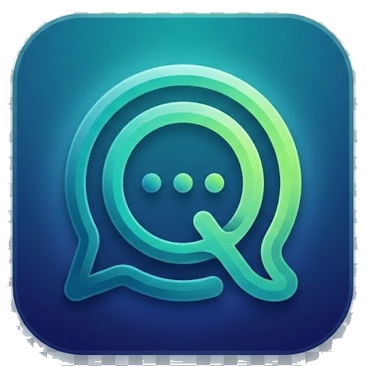

<div align="center">



# TalQ

**A native desktop client for Nextcloud Talk — drawn, not wrapped.**

Your team chat as a real desktop app: instant open, near-zero idle, built to be left running all day.

<sub>Stable codename: **Slartibartfast** (the **0.50** milestone) — the *Hitchhiker's Guide* planetary coastline designer who won an award for the fjords of Norway and liked to sign his name in the crinkly bits, a maker who sweats the fine detail. The 0.50 release caps the line he names: acoustic **echo cancellation** (subtracting the room's own reflections from your mic), full-display **screen sharing on hybrid-GPU laptops**, native-resolution window sharing, and a long tail of call, chat and status polish. He carries the *Hitchhiker's Guide* thread forward — *Deep Thought* (0.42, the computer that found **42**) → *Magrathea* (0.44) → *Slartibartfast* — after **Botev** (0.48, Heroes' Day) and **Margaritka** (0.46, Children's Day), and the 150th-anniversary cycle of Bulgaria's 1876 April Uprising before that: *Aprilsko Vastanie* → *Panagyurishte* → *Koprivshtitsa* 🌌🇧🇬</sub>

</div>

> ⚠️ **Status:** Chat is the solid, daily-driver core. **Audio/video
> calls, simulcast quality switching, and screen sharing now work end to
> end** and are verified in real two-party use (1:1 and MCU/conference)
> as of v0.38.0. Simulcast publishing (180p / 360p / 720p layers, with
> per-receiver substream selection) shipped in stable after end-to-end
> harness validation across all three substream levels. The remaining
> work is breadth of cross-network/NAT hardening and multi-party
> validation beyond two peers. Windows only for now.

---

## Why I built this

I run an ISP. Nextcloud Talk is how my team actually talks to each other
all day — support, on-call, the lot. The official Talk desktop app is an
Electron shell around the web client, and it works: it's the reference,
it's maintained by people who know the protocol far better than I do, and
TalQ wouldn't exist without it to learn from.

But "works" and "I want this open for nine hours a day" are different
bars. On the machines my staff actually use, a Chromium instance per chat
window is real RAM and real latency. I wanted something that opened
instantly, idled at near-zero CPU, survived being left running for a week,
and felt like a *desktop app* — native notifications, a tray that behaves,
a window that doesn't hitch when a message arrives.

So TalQ is a native Qt client. No web view. The conversation list and
messages are drawn directly with QPainter; the whole thing is built around
three words I kept coming back to — *calm, warm, fast*. It speaks the same
Nextcloud Talk HTTP API the official client does; it just renders it the
way I wanted to look at it forty times a day.

It's an unofficial client. Nextcloud® is their trademark and their
protocol, and I'm grateful for both. This is just what happens when
someone who ships software for a living has to live inside a tool:
eventually you rebuild the part that's between you and the work.

## What it is

- **Conversation list** — unread badges, mentions, favorites grouped on
  top, plus sort (recent / unread / name) and filter (all / unread /
  favorites / direct / groups).
- **Messaging** — message bubbles, threads, replies with quoted context,
  reactions, read receipts, date separators, in-conversation search.
- **Files** — share from disk or Nextcloud, image previews, and a
  per-conversation "shared files" view.
- **Live updates** — long-poll for new messages; native notifications and
  a tray that stays out of the way.
- **Calls** — one-to-one and group audio/video over WebRTC, screen
  sharing with live thumbnail picker, optional noise suppression.
  **Simulcast publishing** sends three layers (180p / 360p / 720p) so a
  receiver on a weak network can drop down without dragging everyone
  with them; a **manual Quality chip** on the call screen lets you
  override the per-tile auto-select. *(Working end to end; multi-party
  hardening — see Status.)*
- **Mission Control** — a live telemetry panel on the call screen
  (outbound bandwidth sparkline, codec / encoder / TX-RX resolution
  cards, per-participant subsystem chips) and a matching strip on the
  Settings dialog. One diagnostic surface, one design language.
- **Four themes** — Ember, Warm, Vivid, Paper. Calm, warm, fast.
- **Built to idle** — QPainter-on-QWidget rendering, no web engine; near-
  zero CPU at rest.
- **Self-tested** — `talq-call-test` is a headless harness that runs the
  real publish + subscribe pipelines against the MCU and asserts
  end-to-end correctness for simulcast, substream switching, screen
  sharing, mute propagation, and more — so regressions surface without a
  human in the loop.

## Requirements

- **Windows 10/11, 64-bit.** TalQ currently uses Windows-specific media
  and compositor paths; Linux/macOS are not supported yet.
- A **Nextcloud server with the Talk app** enabled, and an account on it.

Prebuilt installers are published on the
[Releases](https://github.com/kalinbogatzevski/talq-desktop/releases) page.
To build from source, read on.

## Build from source (Windows)

TalQ builds with the **MinGW** toolchain (Qt's `mingw_64` kit) and links
**GStreamer from MSYS2**. Both are required; calls won't compile without
GStreamer. The toolchain is intentionally pinned (Qt 6.8.2 + MinGW 13.1 +
GStreamer 1.28.x) — other versions may work but these are what's tested.

### Prerequisites

- **Python 3.10+** (for `aqtinstall`)
- **Git** (Git Bash provides the shell the commands below assume)
- **MSYS2** — provides the GStreamer runtime + dev packages
- *(optional)* **Visual Studio 2022 Build Tools** with the C++ workload +
  a Windows 11 SDK — only needed to build the single-**window** screen-share
  helper (see step 5). Everything else, including whole-screen sharing,
  builds without it.

### 1. Install Qt 6.8.2 + build tools

```bash
pip install aqtinstall

# Qt 6.8.2 with MinGW + WebSockets + Multimedia
python -m aqt install-qt windows desktop 6.8.2 win64_mingw --outputdir C:\Qt -m qtwebsockets qtmultimedia

# MinGW 13.1 compiler, CMake, Ninja
python -m aqt install-tool windows desktop tools_mingw1310 --outputdir C:\Qt
python -m aqt install-tool windows desktop tools_cmake --outputdir C:\Qt
python -m aqt install-tool windows desktop tools_ninja --outputdir C:\Qt
```

You should now have `C:\Qt\6.8.2\mingw_64\`, `C:\Qt\Tools\mingw1310_64\`,
`C:\Qt\Tools\CMake_64\`, `C:\Qt\Tools\Ninja\`.

### 2. Install MSYS2 + GStreamer

Install **MSYS2** from <https://www.msys2.org> (default location
`C:\msys64`). Then, in an **MSYS2 MinGW64** shell, install GStreamer and the
plugin sets TalQ uses (WebRTC, the codec/parser elements, the Windows
capture/output backends):

```bash
pacman -Syu     # update first (re-open the shell if it asks you to)
pacman -S --needed \
  mingw-w64-x86_64-gstreamer \
  mingw-w64-x86_64-gst-plugins-base \
  mingw-w64-x86_64-gst-plugins-good \
  mingw-w64-x86_64-gst-plugins-bad \
  mingw-w64-x86_64-gst-plugins-ugly \
  mingw-w64-x86_64-gst-plugins-rs \
  mingw-w64-x86_64-gst-libav
```

CMake looks for GStreamer under `C:/msys64/mingw64` by default (the
`GSTREAMER_ROOT` cache variable). If your MSYS2 is elsewhere, pass
`-DGSTREAMER_ROOT=/path/to/mingw64` at configure time.

### 3. Clone

```bash
git clone https://github.com/kalinbogatzevski/talq-desktop.git
cd talq-desktop
```

> Use a path without non-ASCII characters — Qt's tooling breaks on
> Cyrillic/OneDrive paths.

### 4. Configure and build

```bash
# Git Bash — MinGW + CMake + Ninja on PATH
export PATH="/c/Qt/Tools/mingw1310_64/bin:/c/Qt/Tools/CMake_64/bin:/c/Qt/Tools/Ninja:/c/msys64/mingw64/bin:$PATH"
cmake -B build -G Ninja -DCMAKE_BUILD_TYPE=Release \
  -DCMAKE_PREFIX_PATH=/c/Qt/6.8.2/mingw_64 -DCMAKE_CXX_COMPILER=g++ -Wno-dev
cmake --build build --target talq
```

### 5. *(optional)* Build the window-capture helper

Sharing a **single application window** (rather than a whole monitor) uses
Windows Graphics Capture, whose headers ship only with MSVC + the Windows 11
SDK — not with the MinGW GStreamer TalQ otherwise uses. So it lives in a tiny,
self-contained C-ABI DLL loaded at runtime. Whole-screen sharing works without
it; if you skip this step, picking a window just reports that window capture
is unavailable.

```bash
# From a shell where cmd is available (needs VS2022 Build Tools + Win11 SDK):
cmd //c native/wgc/build.bat     # produces native/wgc/talq_wgc.dll
```

### 6. Deploy the runtime + run

The app needs the Qt and GStreamer DLLs (and GStreamer plugins) beside the
executable. `scripts/deploy-dev.sh` copies them all into the build dir and
launches:

```bash
bash scripts/deploy-dev.sh        # deploy Qt + GStreamer DLLs/plugins (+ talq_wgc.dll) and run
# or, to deploy without launching:
bash scripts/deploy-dev.sh --no-run
```

To produce a packaged Windows installer (Inno Setup required, `ISCC` on
PATH), see `scripts/build-release.sh`.

## Usage

Launch TalQ, sign in through your Nextcloud server's browser login
(Login Flow v2 — no embedded browser, no password stored), and your
conversations appear. The funnel control in the search row sorts and
filters the list; Settings → Audio & Video selects devices and toggles
noise suppression.

## Status

TalQ is what I use every day, but it's honest about where it is:

- **Solid:** chat, threads, reactions, file sharing, search,
  notifications, the conversation list — the things I rely on for hours a
  day.
- **Solid in two-party use:** **audio/video calls, simulcast quality
  switching, and screen sharing.** As of v0.38.0 the WebRTC pipeline is
  verified working end to end in real 1:1 and MCU/conference use —
  hardware H264, three-layer simulcast publishing with auto + manual
  substream selection, screen sharing with live-thumbnail picker — with
  crash barriers so a media failure can't take the app down. A headless
  self-test suite (`talq-call-test`) asserts the entire publish +
  subscribe path against the MCU on every release.
- **Multi-party (3+ peers):** works, but hasn't been validated as
  exhaustively as 1:1; field reports from larger meetings are the most
  useful contribution right now.
- **Windows only.** Linux/macOS would need the media/compositor paths
  reworked.
- **Help especially welcome here:** call reliability across the range of
  NAT, firewall, and device configurations real users have is where
  outside testing and bug reports move the needle most.

I'd rather you know that going in than discover it on a customer call.

## Architecture

- **Qt 6.8.2 Widgets**, **C++20**, MinGW 13.1, CMake + Ninja.
- The conversation list and message view are rendered with **QPainter on
  QWidget** — no QML, no web engine. Earlier versions used QML; it was
  replaced for rendering control and idle cost.
- **GStreamer** WebRTC pipelines for calls.
- Talks to Nextcloud over the **OCS v2 / Talk Chat / Login Flow v2** HTTP
  APIs — no Nextcloud code is linked.

## Contributing

Issues and PRs welcome. The single highest-value area is **call
reliability across real networks** — if you can reproduce a call failure
with details about your NAT/firewall/devices, that's gold. Please keep the
*calm, warm, fast* design intent in mind for UI changes.

## License

TalQ is licensed under the **Apache License 2.0** — see [`LICENSE`](LICENSE).

It links and bundles third-party components (Qt and GStreamer under LGPL,
the Twemoji emoji set under CC-BY 4.0, the Inter typeface under the SIL
OFL) under their own terms; see [`NOTICE`](NOTICE) and
[`THIRD-PARTY-NOTICES.md`](THIRD-PARTY-NOTICES.md).

"Nextcloud" is a registered trademark of Nextcloud GmbH. TalQ is an
independent, unofficial client and is not affiliated with or endorsed by
Nextcloud GmbH.

---

Built by **Kalin Bogatzevski**. By day I work on the commercial side —
**[ISPCQ](https://ispcq.com)**, the multi-tenant ISP/ERP platform. TalQ is
the same engineering DNA applied to a desktop client.

Open-sourced because the tool you live inside all day shouldn't be a black
box — and because good software is the best advertising I know.
